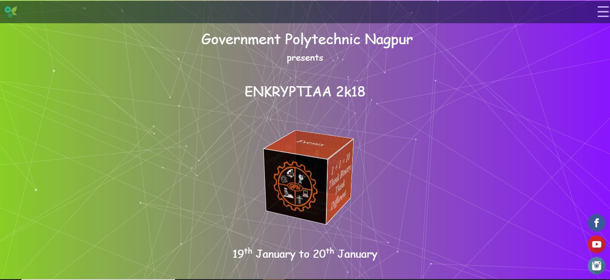

# Enkryptiaa-18
Official site of Enkryptiaa'18

Enkryptiaa is the annual technological and entrepreneurial festival organized by the students of Government Polytechnic, Nagpur under INFOCOM forum of IT/CM students.

Enkryptiaa believes in fostering the spirit of innovation and igniting young minds towards a more technologically and economically viable future. The festival is held over 2-3 days every January and attracts participants from every corner of the nagpur as well as from outside, comprising a total footfall of over 1000 from all over Nagpur.
Enkryptiaa comprises of ardent competitions, elucidative workshops, exhibitions, illuminating talks that inspire, enthrall and mesmerize the massive hordes that attend. This website was used created for publicity of Enkryptiaa'18

<b>link to the website https://harshrajdhote.github.io/enkryptiaa-18/ </b>

